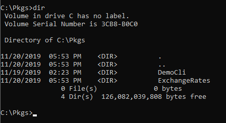
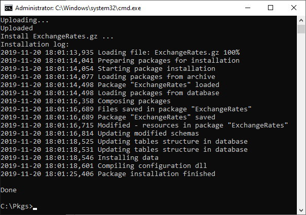
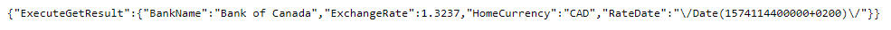

[](https://github.com/sindresorhus/awesome#readme)
# Exchange Rates  
This project adds necessary classes to obtain curent and historic Exchange Rates from the following banks
- European Central Bank
- Bank of Canada
- Central Bank of the Russian Federation
- National Bank of Ukraine

## Installation
Use clio (formely known as bpmcli) to install this project
#### Step 1 - Add Environment to cli
```text
clio reg-web-app EnvironmentName -u https://domain.creatio.com -l Supervisor -p Supervisor -m YourCompanyName
```
#### Step 2 - Install Package with cli tool
Make sure you are in the same directory as the package root folder.
```text
clio push-pkg ExchangeRates -e EnvironmentName
```


If everythig went well you will see a similar result


#### Verify Istallation
Try going to the following url from the browser that is already authenticated
It will return USD/CAD exchange rate for Nov 20, 2019 from the Bank of Canada
 ```text
 http://domain.creatio.com/0/rest/ExchangeRate_WS/ExecuteGet?bankId=0&date=2019-11-20&currency=USD
 ```
 


## Usage
<p>
Every bank implements IBank interface that is returned from the factory method BankFactory.GetBank(BankFactory.SupportedBanks).
IBank declares GetRateAsync method that returns IBankResult.</p>
<p>
Some banks do not return Fx Rates for the current day, thus GetRateAsync will get the latest known rate.
For instance, Bank of Canada will not return rates for non-banking days, thus GetRateAsync will recursively ask 
for the previous day until there is a result
</p>


```C#
using System;
using System.ServiceModel;
using System.ServiceModel.Activation;
using System.ServiceModel.Web;
using System.Threading.Tasks;
using Terrasoft.Web.Common;

namespace ExchangeRates
{
	[ServiceContract]
	[AspNetCompatibilityRequirements(RequirementsMode = AspNetCompatibilityRequirementsMode.Required)]
	public class ExchangeRate_WS: BaseService
	{
		[OperationContract]
		[WebInvoke(Method = "GET", RequestFormat = WebMessageFormat.Json,
		BodyStyle = WebMessageBodyStyle.Wrapped, ResponseFormat = WebMessageFormat.Json)]
		public BankResult ExecuteGet(int bankId, string date, string currency)
		{
			DateTime.TryParse(date, out DateTime dt);
			IBank bank = BankFactory.GetBank((BankFactory.SupportedBanks)bankId);

			IBankResult bankResult = Task.Run(() => bank.GetRateAsync(currency.ToUpper(), dt)).Result;
			BankResult result = new BankResult
			{
				ExchangeRate = bankResult.ExchangeRate,
				RateDate = bankResult.RateDate,
				HomeCurrency = bankResult.HomeCurrency,
				BankName = bankResult.BankName
			};
			return result;
		}
	}
}
```


## Tools
- [Clio](https://github.com/Advance-Technologies-Foundation/clio) - CLI Library to create packages.
- [Bpmonline.SDK](https://www.nuget.org/packages/BpmonlineSDK/) - Provides project template for development code for bpm'online platform.

## Documentation
- [Creatio](https://academy.creatio.com/documents/technic-sdk/7-15/creatio-development-guide) - Creatio Development Guide
- [ECB](https://sdw-wsrest.ecb.europa.eu/help/) - European Central Bank API Documention
- [BOC](https://www.bankofcanada.ca/valet/docs) - Bank of Canada Valet API Documentation
- [CBR](https://www.cbr.ru/development/DWS/) Central Bank of the Russian Federation API Documentation
- [NBU](https://old.bank.gov.ua/control/en/publish/article?art_id=82367624&cat_id=25365629) - National Bank of Ukraine API Documentation